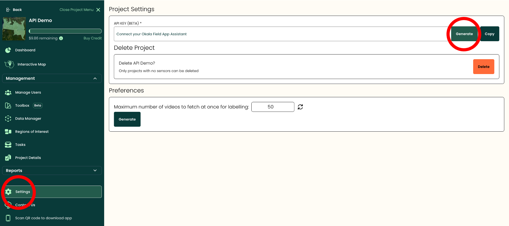

```{r setup, include=FALSE}
knitr::opts_chunk$set(echo = TRUE)
library(okalaR)
library(jsonlite)
```

# Getting Started

This tutorial demonstrates how to use the `okalaR` package to interact with the Okala dashboard API. With `okalaR`, you can retrieve, manage, and analyze data efficiently using R.

## Authentication

Your API key is found in your project settings on the Okala dashboard: [https://dashboard.okala.io/](https://dashboard.okala.io/)

```{r clustered_farms, echo = F, out.width= "55%", fig.align = 'left'}


```

To use the `OKALA_API_KEY` in your R package, you need to create an environment variable to store your API key. The API key depends on the project you are working on.

**Step 1: Open Your Terminal:**
Navigate to your system terminal (e.g., Command Prompt, Terminal, or shell interface).

**Step 2: Create or Open the `.Renviron` File:**
In your terminal, navigate to your home directory or your project directory. Then, create or open a file named `.Renviron` using a text editor. For example:
`bash nano ~/.Renviron`

**Step 3: Add your API Key:** Inside the .Renviron file, add the line `OKALA_API_KEY=api_key_value`

**Step 4: Save and Exit:** Ensure the .Renviron file is save in the correct directory

**Step 5: Restart Your R Session:** Restart your R session to load the new environment variable. Alternatively, you can reload the .Renviron file manually in R using the following command:
```{r, eval = FALSE}

readRenviron("~/.Renviron")

```
**Step 6: Verify the Environment Variable:** To ensure the variable is correctly configured, run this command in your R console:

```{r, eval = FALSE}
Sys.getenv("OKALA_API_KEY")
```
If everything is set up properly, it should return your API key.

Now, you should be able to run the following functions.
```{r auth, eval=FALSE}
api_key <- get_key()
headers <- auth_headers(api_key)
```

## Get Project Information

This function helps confirm which project you are working on in the dashboard

```{r get-project, eval=FALSE}
get_project(hdr = headers)
```

## Get Station Information

`datatype`: Specifies the type of data to retrieve ("video","image" or "audio")

```{r get-stations, eval=FALSE}
stations <- get_station_info(hdr = headers, datatype = "video")
plot_stations(stations)
```

## Get Media Labels for Sensors

Retrieve labels and metadata for all processed files. `datatype`: Specifies the data type ("video" in this case), `psrID`: Links to the project system record ID from the stations

```{r get-media-labels, eval=FALSE}
media_labels <- get_media_assets(hdr = headers,
                                 datatype = "video",
                                 psrID = stations$project_system_record_id)
```

## Get Project Labels

Retrieve all taxonomic labels associated with the project
`labeltype`: Filters the labels to include only those of type "Camera" and "Bioacoustics"

```{r get-project-labels, eval=FALSE}
project_camera_labels <- get_project_labels(hdr = headers, labeltype = 'Camera')
```

## Retrieve All Possible Taxonomic Labels

The `getIUCNLabels` function retrieves taxonomic labels from the IUCN database.

- **`limit`**: Specifies the maximum number of labels to retrieve.
- **`search_term`**: Filters the results by the specified Latin name. To retrieve all labels without filtering, omit this parameter or set it to `NULL`.
- **`offset`**: Determines the starting position for the results, useful for handling large datasets.


```{r get-iucn-labels, eval=FALSE}
labelled_data <- getIUCNLabels(hdr = headers,
                              limit = 2000,
                              offset = 0,
                              search_term = 'Panthera pardus')
```


